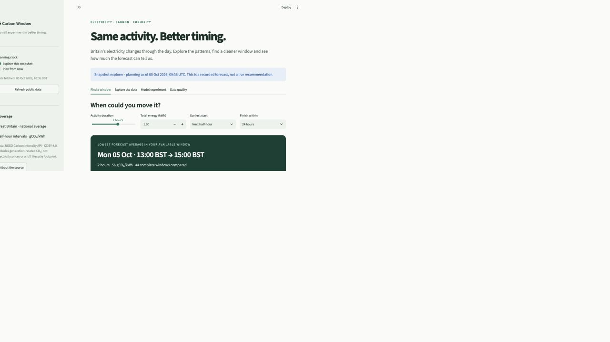
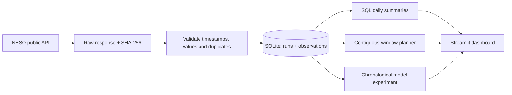

# Carbon Window

**Can moving an activity by a few hours change its estimated electricity-related CO₂?**

Carbon Window turns public electricity data into an interactive answer. Choose a duration,
energy use and finish time; compare every complete half-hour window in NESO's forecast.
Then explore the historical patterns and test whether a more complex model earns its place.

Python · SQL / SQLite · pandas · scikit-learn · Streamlit · automated tests



## Try it

Requires Python 3.12. The repository includes a real, dated snapshot, so the app works
without an API key or a first-run download.

```bash
python3.12 -m venv .venv
source .venv/bin/activate              # Windows: .venv\Scripts\activate
pip install -r requirements.txt
streamlit run app.py
```

The initial view deliberately explores the **saved snapshot**, with its date visible.
Choose **Refresh public data**, then **Plan from now** for a current forecast.
Planning pauses when the saved forecast is over two hours old. No appliance is controlled.

## What is inside

| Part | What it demonstrates |
|---|---|
| Window planner | A clear user question, constrained search, units and explicit assumptions |
| Data pipeline | REST ingestion, retry/backoff, 14-day chunks, validation and source hashes |
| SQLite storage | Versioned runs, foreign keys, composite keys, atomic writes and SQL aggregation |
| Historical explorer | Time series, local-time heatmap, missing-value handling and CSV export |
| Model experiment | Chronological evaluation, two simple baselines, reproducible results and limitations |
| Quality view | Coverage, missing actual estimates, provenance and recoverable failed refreshes |

## A result worth explaining

On the snapshot fetched **5 October 2026**, 4,416 half-hour records cover a 90-day
historical window plus two forecast days. Three later weeks are held out, one week per fold,
with expanding training sets. The model settings are fixed before evaluating those weeks.

| Method | Mean weekly MAE ↓ | Mean weekly RMSE ↓ |
|---|---:|---:|
| Training-period mean | 42.94 | 50.59 |
| Time-of-day mean | **38.47** | **45.59** |
| Calendar gradient boosting | 40.26 | 48.73 |

Units: gCO₂/kWh. The simple time-of-day baseline performs better than the more complex
calendar model in this sample. Adding a model did not automatically improve the answer.
The experiment needs broader seasonal validation and richer inputs before deployment.
Full fold boundaries, scores and predictions are in [`reports/evaluation.json`](reports/evaluation.json).

**The planner uses NESO's forecast, not the experimental model.** The historical provider
forecast has no issue timestamp in this endpoint, so it is not presented as a fair day-ahead
competitor in the model benchmark.

## Reproduce the pipeline and experiment

```bash
pip install -r requirements-dev.txt
python -m pytest -q
python -m carbon_window.pipeline --days 90
python -m carbon_window.evaluate --output reports/live-evaluation.json
```

To deliberately replace the bundled demo, add `--export-demo` to the pipeline command
and regenerate `reports/evaluation.json`. Review changed results before updating this README.
Each refresh stores a new run in the local database. It never overwrites the prior snapshot.
The app will not show old evaluation scores as if they belonged to newly fetched data.



## Decisions and limits

- **Great Britain, not the whole UK.** This uses national-average data, not a household's
  regional or supplier-specific footprint.
- **Estimated actuals.** The API's `actual` field is an estimate from metered generation;
  it is not a direct measurement of an individual activity's emissions.
- **Average-intensity accounting.** Uniform consumption is assumed within the activity.
  The difference between two windows is an estimate, not a demonstrated causal reduction
  in grid emissions. There are no electricity-price inputs or bill-saving claims.
- **UTC storage, local display.** Half-hours remain unique through daylight-saving changes.
  Planner labels use Europe/London; chart axes and SQL daily aggregates explicitly use UTC.
- **No silent gap filling.** Missing values stay missing. A planning window crossing a gap
  is ineligible. Historical missingness allows a two-hour reporting grace period.
- **No future-target leakage.** Model features are calendar values known ahead of time.
  Training and test weeks are chronological. Historical revisions and the short seasonal
  sample still limit what the benchmark can establish.
- **A local app.** The code and reproducible demo are available here; a hosted deployment
  is not claimed. GitHub checks run without network access to the data provider.

## Explore the code

```
app.py                       Interactive dashboard
carbon_window/pipeline.py    Collection, validation and transactional storage
carbon_window/analysis.py    SQL summaries and planning calculations
carbon_window/evaluate.py    Expanding-window experiment
data/demo.json               Dated public-data snapshot, with source hashes
reports/evaluation.json      Per-fold metrics and predictions
tests/                      Pipeline, calculations, leakage and UI checks
docs/WALKTHROUGH.md          Decisions, explanations and small exercises
```

## Source and licence

Data: [NESO Carbon Intensity API](https://carbonintensity.org.uk/), developed with
Environmental Defense Fund Europe, the University of Oxford and WWF, licensed under
[CC BY 4.0](https://creativecommons.org/licenses/by/4.0/).
Data is normalised, aggregated and visualised here; this project is independent of NESO.
[API documentation](https://carbon-intensity.github.io/api-definitions/).
Code is licensed under MIT; see [LICENSE](LICENSE).
